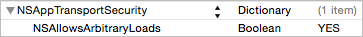

# Teads iOS SDK

<p align="center">
    
    
    <a href="https://cocoapods.org/?q=TeadsSDK"></a>
</p>

Teads allows you to integrate a single SDK into your app, and serve premium branded "outstream" video ads from Teads SSP ad server. 
This iOS Demo App includes the Teads Framework and is showing integration examples.

## Documentation

Integration instructions are available on [Teads SDK documentation](http://mobile.teads.tv/sdk/documentation/)

## Install Teads SDK using static library

Read [Project Setup](http://mobile.teads.tv/sdk/documentation/ios/ios-project-setup) from our documentation

## Install Teads SDK using CocoaPods

Install CocoaPods from your terminal:

```
$ sudo gem install cocoapods
```

### Try our SDK on a demo project

You can try our SDK with `pod try` command in your terminal. This will get you our TeadsSDKDemo functionnal project which includes our SDK.

```
$ pod try TeadsSDK
```

### Add Teads SDK to your iOS project

CocoaPods is a dependency manager for Xcode projects.

1. In terminal, go to the directory containing your project's `.xcodeproj` file and run `pod init` command:

    ```
    $ pod init
    ```

2. Open and edit the created file named `Podfile` to add our SDK pod reference `pod 'TeadsSDK'` :

    ```
    target 'YourProject' do
        pod 'TeadsSDK'
    end
    ```

3. In terminal in the directory containing your project's `.xcodeproj` file and the Podfile, run `pod install` command. This will install Teads SDK along with our needed dependencies.

    ```
    $ pod install
    ```

4. Once the installation is finished, open the `.xcworkspace` of your app to launch Xcode. Your project files should include a Pods project with the dependencies for TeadsSDK. From now on you will have to use this file for your app's developments.

## App Transport Security

Even if Teads SDK if fully compliant with iOS 9 network restrictions (SSL ready), third party ad servers don't all use SSL yet. This is why we highly recommend to allow non-ssl connexions until all ad servers and tracking vendors are ssl compliant too.

You should add the `NSAppTransportSecurity` exception with `NSAllowsArbitraryLoads` exception to plist:



```xml
<key>NSAppTransportSecurity</key>
<dict>
    <key>NSAllowsArbitraryLoads</key>
    <true/>
</dict>
```

## Changelog

Read [changelog here](https://github.com/teads/TeadsSDK-iOS/blob/master/CHANGELOG.md). 
