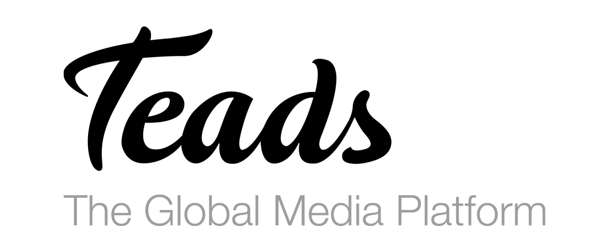
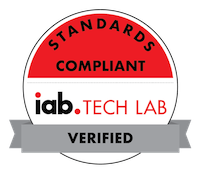

----

Teads allows you to integrate a single SDK into your app, and serve premium branded "outstream" video ads from Teads SSP ad server. This sample app includes Teads iOS framework and is showing integration examples.


> **⚠️ Important ⚠️**
>
> ***Xcode 13***
>
> In Xcode 13, Apple introduced an option to override the version number of every plist present inside your app (https://developer.apple.com/forums/thread/690647). Even those from third parties frameworks like TeadsSDK. We used to rely on the plist to retrieve the TeadsSDK version. To prevent this, we changed the way we checked the SDK version since version 5.0.6. So please update your integration to at least version 5.0.6.
>
> ***Xcode 13 + iOS 15 device***
>
> [#155](https://github.com/teads/TeadsSDK-iOS/issues/155) building your application with **Xcode 13** and running it on **iOS 15 device** will crash when running TeadsSDK, we strongly advise to upgrade to [4.8.8 version](https://github.com/teads/TeadsSDK-iOS/releases/tag/v4.8.8) which fixes this crash
>
> You can still build and publish your app using Xcode 12 with older versions than 4.8.8

## Table of Contents

- [Integration Documentation](#integration-documentation)
- [Migrating from v4 to v5](#migrating-from-v4-to-v5)
- [Run the sample app](#run-the-sample-app)
- [Installation](#install-the-teads-sdk-ios-framework)
- [Mediation Adapters](#mediation-adapters)
- [Certifications](#certifications)
- [Changelog](#changelog)

## Integration Documentation

Integration instructions are available on [Teads SDK Documentation](https://support.teads.tv/support/solutions/articles/36000314785).

## Migrating from v4 to v5

TeadsSDK v5 introduces some changes regarding v4, see [Migration Documentation](https://support.teads.tv/support/solutions/articles/36000314772-migrating-from-v4-to-v5)

## Run the sample app

Clone this repository, open it with Xcode, and run project.

## Install the Teads SDK iOS framework

Teads SDK is currently distributed through CocoaPods. It includes everything you need to serve "outstream" video ads. 

### Cocoapods

To install the TeadsSDK just put this on your podfile, if you've never used cocoapods before please check the [offical documentation](https://guides.cocoapods.org/using/using-cocoapods.html).

```ruby
pod 'TeadsSDK', '~> 5.0'
```

On your terminal, go to the directory containing your project's `.xcodeproj` file and your Podfile and run `pod install` command. This will install Teads SDK along with our needed dependencies.

```bash
pod install --repo-update
```


### Swift Package Manager

[SPM](https://swift.org/package-manager/) is a tool for managing the distribution of Swift code. It’s integrated with the Swift build system to automate the process of downloading, compiling, and linking dependencies. To integrate TeadsSDK into your Xcode project using SPM, specify package repository url :

```
https://github.com/teads/TeadsSDK-iOS
```

Then select latest version available

## Mediation Adapters
- [Google AdMob](./MediationAdapters/TeadsAdMobAdapter/README.md)
- [Twitter Mopub](./MediationAdapters/TeadsMoPubAdapter/README.md)
- [Smart AdServer](./MediationAdapters/TeadsSASAdapter/README.md)

## Certifications

Teads SDK supports the [IAB](https://www.iabcertification.com/) [Open Measurement](https://iabtechlab.com/standards/open-measurement-sdk/) SDK, also known as OM SDK. The OM SDK brings transparency to the advertising world, giving a way to standardize the viewability and verification measurement for the ads served through mobile apps.  Teads is part of the [IAB's compliant companies](https://iabtechlab.com/compliance-programs/compliant-companies/). 




## Changelog

See [changelog here](https://github.com/teads/TeadsSDK-iOS/releases). 

