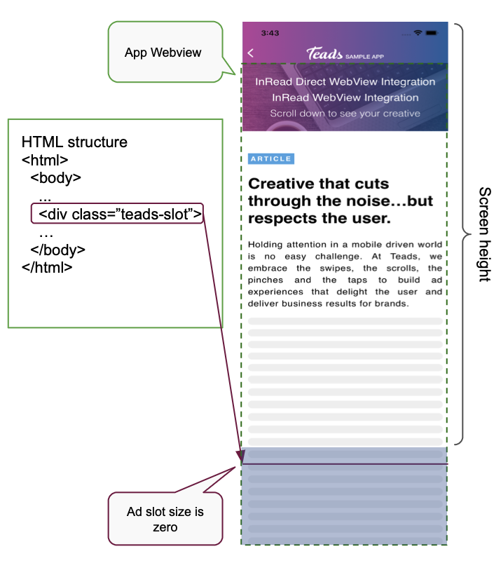
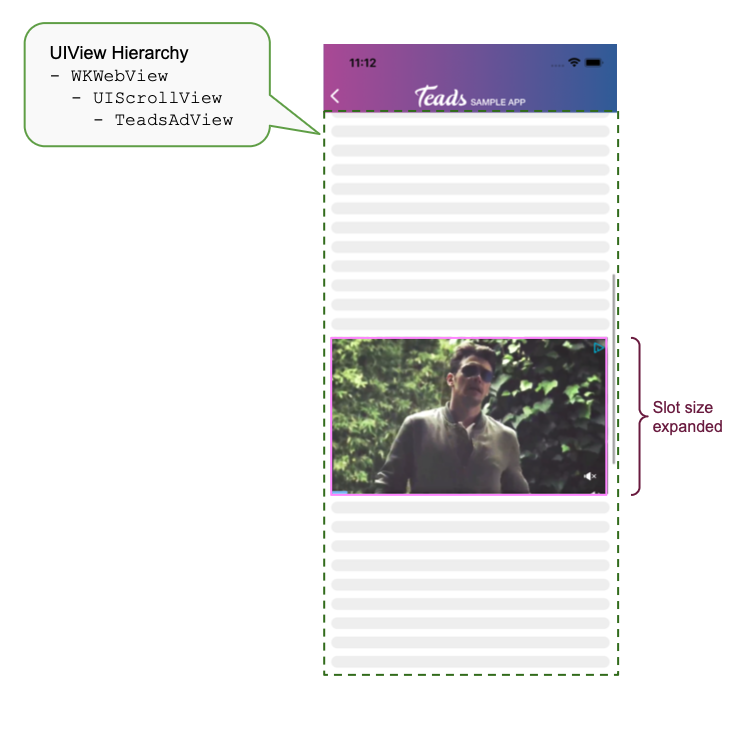

#  TeadsWebViewHelper

> **⚠️ Important ⚠️** 
>
>This helper has been provided to give you a hand in your integration webview.
> It's not designed to work on every integration, it may need to be customized to suit your needs

This helper is designed to fill HTML slot embedded in **your** `WKWebView` 

The Teads Webview Helper adds a JavaScript logic (called bootstrap) into the Webview: 

## Initial configuration
HTML element is set into your web content loaded into your webview

## When an ad is received
1. The bootstrap **expands** the `teads-slot` HTML div to the ad height
2. The `TeadsAdView` is **injected** to `WKWebView.UIScrollView.content` at the `teads-slot` HTML exact position: assuring scroll fluidity 
3. The bootstrap **synchronizes** the `teads-slot` vertical position with the Swift `TeadsAdView`

## When an ad is closed
- The bootstrap **collapses** `teads-slot` height to zero
- The `TeadsAdView` is **removed** from `WKWebView`

## When an ad fails to load
- `teads-slot` size remains zero 

## When the HTML element position is updated
- The `TeadsAdView` position is **updated** accordingly
